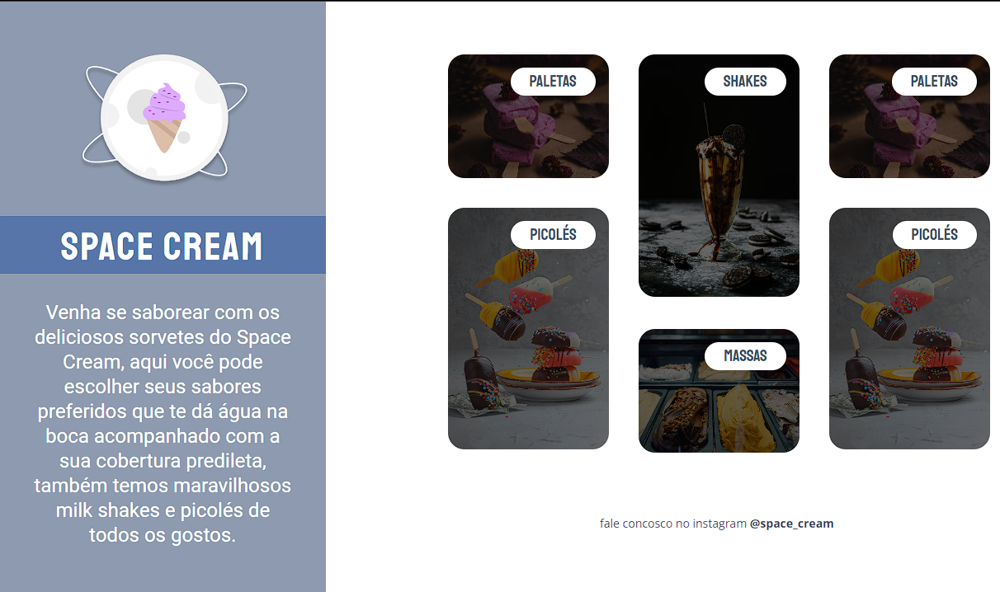

<h1 align="center"> Space Cream Desktop </h1>

Evento exclusivo promovido pela Rocketseat para ensino de tecnologias WEB.

  <a href="#-tecnologias">Tecnologias</a>&nbsp;&nbsp;&nbsp;|&nbsp;&nbsp;&nbsp;
  <a href="#-projeto">Projeto</a>&nbsp;&nbsp;&nbsp;|&nbsp;&nbsp;&nbsp;
  <a href="#-layout">Layout</a>&nbsp;&nbsp;&nbsp;|&nbsp;&nbsp;&nbsp;
  <a href="#-aprendizado">Aprendizado</a>&nbsp;&nbsp;&nbsp;|&nbsp;&nbsp;&nbsp;
  <a href="#memo-licença">Licença</a>

  

 

  

## 🚀 Tecnologias

Esse projeto foi desenvolvido com as seguintes tecnologias:

- HTML e CSS
- Git e GitHub

## 💻 Projeto

Space Cream é um aplicativo de sorvetes podendo escolher o tipo de sorvete.

## 🔖 Layout

Você pode visualizar o layout do projeto através [DESSE LINK](https://www.figma.com/file/nZJ4eVR21caidzuWYM78wu/Stage-03---Grid-com-anima%C3%A7%C3%B5es-(Copy)?). É necessário ter conta no [Figma](https://figma.com) para acessá-lo.  

## 🧠 Aprendizado

Nesse projeto eu aprendi;

- HTML.
- CSS e suas propriedades.
- Grid Area.

## :memo: Licença

Esse projeto está sob a licença MIT.

---
